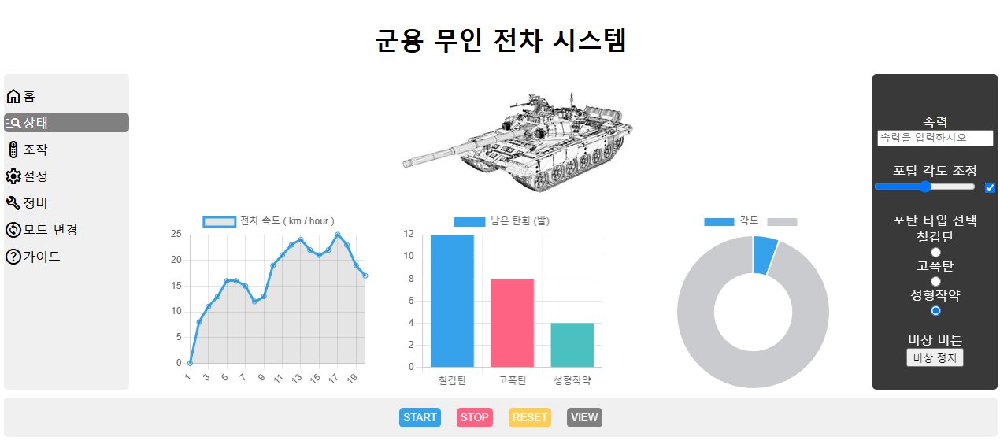
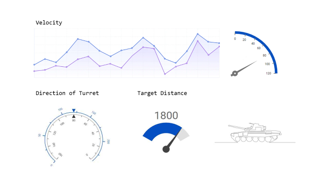

# PJT : Robot Data Visualization  
### Subject  
군용 무인 전차 시스템 UI 웹 화면을 구성하기  
### Result
  
### Introduce  
과제 수행 전 계획했던 이미지  
  
과제 설명  
1. 군용 무인 전차 시스템의 각 데이터를 차트로 표현한다.  
2. 네비게이션바에 전차 시스템을 구성하는 각종 기능을 나열한다.  
3. 각 차트는 전차의 속도 로그, 남은 탄약의 정보, 포신의 각도를 표현한다.  
4. 전차의 속력과 각도, 포탄의 타입 등의 세부 기능을 사이드바에 나열한다.
5. 푸터에는 차량 전체를 제어하기 위한 버튼을 나열한다.  