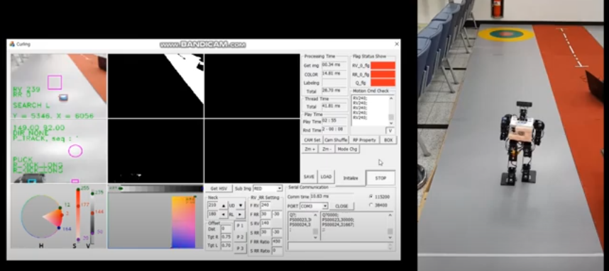

# 🤖 Intelligent Robot Dashboard

**"라즈베리파이 기반 지능형 로봇과 웹 대시보드의 실시간 통신 시스템"**

## 🛠️ 프로젝트 개요

이 프로젝트는 **Express.js**, **MySQL**, **Vue.js**, **WebSocket**, **TCP Socket**, 그리고 **Raspberry Pi** 기반의 지능형 로봇 시스템을 구축한 것입니다.

로봇이 보내는 실시간 데이터를 **웹 대시보드**에서 시각화하고, 사용자는 웹에서 직접 로봇을 조작할 수 있도록 **양방향 통신 시스템**을 구현했습니다.

## 💭 주제 선정 배경

[컬링 시연](https://youtu.be/dHTuKyzpMKk)



---

## 📌 시스템 구조

```scss
[로봇 클라이언트 (Raspberry Pi)]
        ↕ (TCP Socket)
[중계 서버 (Express.js)]
        ↕ (WebSocket)
[웹 클라이언트 (Vue.js)]
```

---

## ⚙️ 주요 기술 스택

| 구성 요소 | 사용 기술 |
| --- | --- |
| **로봇 클라이언트** | Python (socket, threading, RPi.GPIO) |
| **서버** | Express.js + WebSocket + MySQL |
| **웹 대시보드** | Vue.js (Composition API) |
| **통신 방식** | TCP Socket, WebSocket |

---

## 🚀 주요 기능

### ✅ 로봇 클라이언트 (Raspberry Pi)

- **TCP 소켓 연결**을 통해 서버와 통신
- 실시간으로 `speed`, `direction`, `power` 등 로봇 상태 전송
- **LED 제어** 기능 포함 (power 상태에 따라 점멸)
- **Servo 모터 제어** 기능 포함 (PWM을 이용한 모터의 각도 제어)
- 안전하고 유효성 검증된 상태값 처리 로직 구현

### ✅ 중계 서버 (Express.js)

- **TCP 서버**: 로봇과 통신
- **WebSocket 서버**: 웹과 실시간 통신
- **브로커 역할**: 모든 데이터를 양방향 중계
- **REST API**: MySQL에 command 로그 저장 및 조회 제공

### ✅ 웹 클라이언트 (Vue.js)

- 대시보드에서 실시간 상태 시각화
- 사용자 조작을 WebSocket을 통해 전송
- `Home`, `Dashboard`, `Setting` 등 라우팅 분리

---

## 🧪 데이터 흐름

1. 로봇에서 상태 정보 전송 (`speed`, `cur_dir`, 등)
2. TCP 서버 → 중계 서버 → WebSocket → Vue 대시보드
3. 웹에서 사용자 명령 입력 시 WebSocket 통해 서버로 전달
4. 서버 → TCP 소켓 → 로봇 제어

---

## 🗃️ DB 구성 (MySQL)

```sql
sql
복사편집
CREATE TABLE `command_log` (
  `id` INT AUTO_INCREMENT PRIMARY KEY,
  `power` VARCHAR(10),
  `speed` VARCHAR(10),
  `cur_dir` VARCHAR(10),
  `temp_result` VARCHAR(10),
  `neck_angle` VARCHAR(10),
  `cdate` TIMESTAMP DEFAULT CURRENT_TIMESTAMP
);
```

> 웹에서 사용자의 제어 기록은  MySQL DB에 저장됩니다.
> 

---

## 📸 데모 예시

- 로봇이 실시간으로 움직이며, 웹에서 바로 확인 가능
- LED 점등으로 로봇 상태를 시각적으로
- 각종 센서값 및 조작 이력이 실시간 업데이트

---

## 📁 디렉토리 구조

```bash

📦 robot-dashboard-project
├─ 📁 server        # Express + WebSocket + MySQL
│  └─ index.mjs
├─ 📁 vue-client    # Vue 대시보드 클라이언트
│  ├─ views/
│  ├─ components/
│  └─ main.js
├─ 📁 robot-client  # Raspberry Pi 클라이언트
│  └─ main.py
```

---

## 📣 포인트 요약

- 실시간 통신 TCP + WebSocket + Vue.js의 조합
- 라즈베리파이와의 하드웨어 연동 (LED 제어, 모터)
- 사용자 입력 → DB 저장 → 로봇 제어까지 자동화된 파이프라인

---

## 🧠 향후 개선점

- 사용자 인증 시스템 도입
- 센서 추가 및 AI 기반 판단 로직 탑재